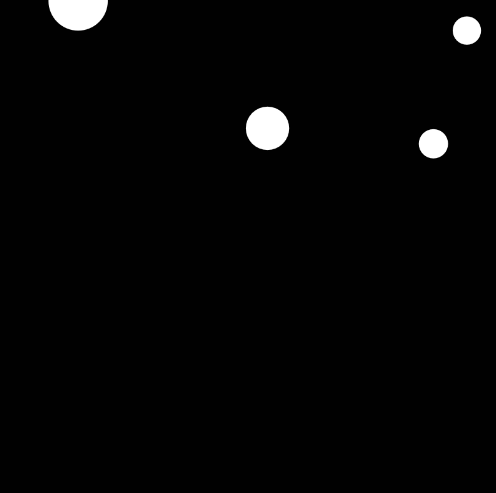

# Codigo Solucion 

Aqui lo realizado fue crear una funcion para que atraves de un ciclo se generen circulos de forma random en el canvas generado, quiete la funcion draw y en la de setup llame a la funcion creada. 

``` js
function setup() {
  createCanvas(400, 400);
  background(1);
  printCircles(4)
}

function printCircles (x) {
    for (let i = 0; i < x; i++) {
    let x = random(width) * cos(frameCount * 0.05) + 50 ; 
    let y = random(height); 
    let d = random(10,50);
    circle(x,y,d);
    
  }
}
```


