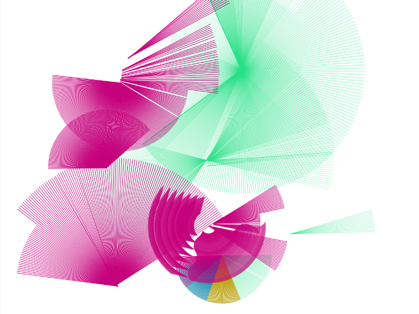

# Actividad 2

## preload()
Carga los archivos SVG en el arreglo lineModule. Estos archivos (02.svg, 03.svg, 04.svg, 05.svg) servirán como pinceles gráficos que el usuario puede seleccionar.
## setup()
* Crea un lienzo del tamaño de la ventana.
* Establece el fondo en blanco.
* Oculta el cursor .
* Define el color inicial.
## windowResized()
Ajusta el lienzo si el usuario cambia el tamaño de la ventana.
## draw()
Este es el corazón del programa. Cuando el usuario presiona el botón izquierdo del mouse:
1.	Captura la posición del mouse (x, y).
2.	Si Shift está presionado, limita el dibujo a líneas horizontales o verticales.
3.	Usa push() y pop() para aplicar transformaciones sin afectar el resto del lienzo.
4.	Gira la imagen o línea .
5.	Incrementa el ángulo de rotación.
## mousePressed()
* Al hacer clic, se elige un tamaño aleatorio para el módulo.
* Guarda la posición inicial del clic.
## keyPressed()
* Arriba / Abajo: Aumenta o disminuye el tamaño del módulo.
* Izquierda / Derecha: Reduce o aumenta la velocidad de rotación.
## keyReleased()
* s: Guarda la imagen como un PNG.
* Delete / Backspace: Limpia el lienzo.
* d: Invierte la dirección de rotación y cambia el ángulo en 180°.
* Espacio: Cambia el color aleatoriamente.
* Teclas 1-4: Cambian el color del pincel a tonos predefinidos.
* Teclas 5-9: Seleccionan diferentes módulos de dibujo. 

