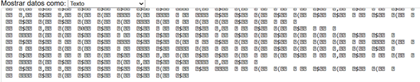
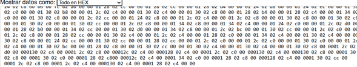
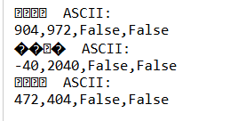
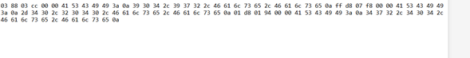

# Actividad 



Se ve así porque se esta enviando en formato



En formato hex se puede ver mejor ya que ASCII lee mejor los formatos Hex ya que ahí se pueden leer binarios

## Ventajas del formato binario 
* Eficiencia en almacenamiento y transmisión: Ocupa menos espacio que el texto en ASCII, ya que representa los datos en su forma más compacta.
* Velocidad de procesamiento: Se puede leer y escribir más rápido, especialmente cuando se trata de grandes volúmenes de datos o comunicación en redes.
* Precisión en datos numéricos: No hay conversión entre texto y números, evitando errores de redondeo o diferencias en formatos de representación.
* Mayor seguridad: Es menos accesible para humanos sin herramientas especializadas, lo que puede ser una capa extra de protección.

## Desventajas del formato binario 
* Menor legibilidad: No se puede leer ni editar fácilmente sin herramientas específicas.
* Dependencia de estructura: Necesita saber el formato exacto (endianness, tipos de datos, etc.) para interpretarlo correctamente.
* Menos interoperabilidad: Puede ser más difícil de compartir entre sistemas diferentes sin un protocolo bien definido.

## ¿Cuántos bytes se están enviando por mensaje?

El formato '>2h2B' se desglosa así:
``` js
*	> → Big-endian (los bytes más significativos van primero).
```
*	2h → Dos enteros cortos (shorts, h), de 2 bytes cada uno (para xValue y yValue).
*	2B → Dos valores sin signo de 1 byte (B), para aState y bState.

## Cálculo del tamaño:
*	2h → 2 × 2 = 4 bytes
*	2B → 2 × 1 = 2 bytes
*	Total = 6 bytes por mensaje

## Representación de números positivos y negativos

El formato h (short) usa 16 bits con signo (complemento a dos).
* xValue = 1000 → 03E8 en Hex
* xValue = -1000 → FC18 en Hex (porque usa complemento a dos)





## Diferencias entre ASCII y Binario en tu experimento
1.	ASCII
* Se puede leer fácilmente (904,972,False,False).
* Cada número y carácter ocupa más espacio porque está representado en texto.
* Es fácil de depurar e interpretar en cualquier editor de texto.

2.	Binario
* No es legible directamente (??␂␂??).
* Es más compacto y eficiente en términos de almacenamiento y transmisión.
* Puede representar números negativos correctamente usando complemento a dos.

## Ventajas y Desventajas de Cada Formato

1. Ventajas del binario
* Eficiencia: Ocupa menos espacio y es más rápido de procesar.
* Precisión: No hay errores por conversión de tipos de datos.
* Adecuado para hardware y protocolos de comunicación que esperan datos en un formato compacto.

2. Desventajas del binario
* No es legible para humanos: Se necesitan herramientas para decodificarlo.
* Depuración complicada: No se puede ver el contenido fácilmente en un editor de texto.
* Dependencia del formato: Si el orden de los bytes cambia (endianness), el significado puede alterarse.

3. Ventajas del ASCII
* Legibilidad: Se puede leer y modificar en cualquier editor de texto.
* Compatibilidad universal: Puede ser interpretado por cualquier sistema sin problemas de codificación.
* Fácil de depurar: Si algo sale mal, puedes inspeccionar los valores directamente.

4. Desventajas del ASCII
* Ineficiencia en tamaño: Cada número se almacena como una cadena de caracteres en lugar de su valor binario compacto.
* Conversión lenta: Se necesita convertir el texto a números antes de procesarlo.
* Dificultades con caracteres especiales: Algunos caracteres pueden causar problemas en ciertos sistemas de transmisión de datos.
