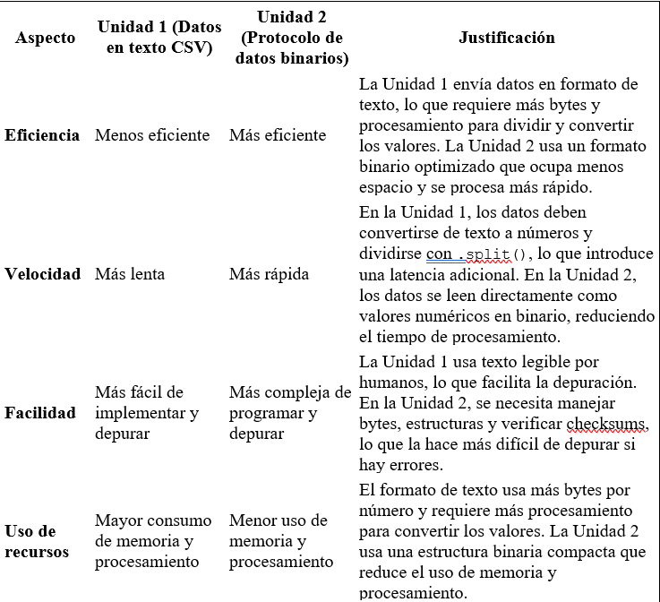

# Actividad 5

## ¿Por qué fue necesario introducir framing en el protocolo binario?
El framing es necesario en el protocolo binario porque, a diferencia del formato de texto (donde los datos están separados por comas y terminan con un salto de línea), en un flujo binario no hay una separación clara entre paquetes de datos. Sin un sistema de delimitación, el receptor no podría identificar dónde empieza y termina cada mensaje.
Por esto, en la Unidad 2 se usa un byte especial de header (0xAA), que indica el inicio de un paquete de datos.

## 2. ¿Cómo funciona el framing?

El framing organiza los datos en paquetes con una estructura fija para que el receptor pueda leerlos correctamente. En nuestro protocolo binario, el framing funciona de la siguiente manera:
1.	Byte de inicio (header): 0xAA → Indica el comienzo de un paquete.
2.	Datos: Incluyen valores del acelerómetro (x, y), estados de los botones (A, B).
3.	Checksum: Un byte final que permite verificar si los datos llegaron correctamente.

## ¿Qué es un carácter de sincronización?
Un carácter de sincronización es un byte especial en la transmisión de datos que ayuda a identificar el inicio de un mensaje o paquete. En nuestro protocolo binario, el byte 0xAA cumple esta función.

## ¿Qué es el checksum y para qué sirve?
El checksum es un mecanismo de detección de errores que ayuda a verificar la integridad de los datos recibidos. En nuestro protocolo, se calcula sumando todos los bytes del paquete (excepto el header) y tomando el módulo 256.

## ¿Por qué se usa concat aquí?
Porque la lectura desde el puerto serial puede no traer un paquete completo en una sola llamada. 

## ¿Por qué el bucle se ejecuta solo si serialBuffer.length >= 8?
Porque cada paquete binario tiene exactamente 8 bytes

## ¿Qué significa 0xAA?
0xAA es un número hexadecimal que equivale a 170 en decimal y a 10101010 en binario.

Este valor se usa como carácter de sincronización o “header” para marcar el inicio de un nuevo paquete. Es útil porque tiene un patrón binario bien definido y poco probable que aparezca por accidente en los datos.

## ¿Qué hace serialBuffer.shift()?
shift() elimina y devuelve el primer elemento del arreglo serialBuffer.

En este caso, se usa para descartar un byte que no es parte del paquete.
## ¿Qué hace continue? ¿Por qué se usa?
continue hace que el bucle salte al siguiente ciclo sin ejecutar lo que viene después dentro del bucle actual.

## ¿Qué hace la instrucción break?
* break se usa para detener el bucle inmediatamente.

Se activa cuando hay menos de 8 bytes en el buffer, porque eso significa que no hay suficiente información para procesar un paquete completo.

## slice()
Devuelve una copia de una parte del arreglo (desde inicio hasta fin, sin incluir fin).

## splice()
Elimina elementos del arreglo original, empezando desde inicio, y puede opcionalmente reemplazarlos.

## ¿Por qué se usan juntas?
Se usa slice() para copiar el paquete de 8 bytes que vamos a procesar, y luego splice() para eliminar esos mismos bytes del buffer, ya que ya fueron procesados.

## ¿Qué hace reduce()?
La función reduce() recorre un arreglo y acumula un solo resultado (por ejemplo, una suma, producto, promedio, etc.).

## ¿Por qué se compara el checksum enviado con el calculado? ¿Para qué sirve esto?
* computedChecksum: lo calcula tu programa con los datos recibidos 
* receivedChecksum: es el valor que el micro:bit ya envió como parte del paquete.

## ¿Para qué sirve esto?
Verificar que los datos no se corrompieron durante la transmisión por el puerto serial.

## ¿Qué hace continue?
La instrucción continue salta el resto del código dentro del bucle actual y pasa directamente a la siguiente iteración del bucle.

## ¿Qué es un DataView?
Un DataView es una interfaz en JavaScript que te permite leer y escribir datos binarios crudos (como enteros y flotantes) en un ArrayBuffer, con control total del tipo de dato, longitud y endianess (orden de los bytes).

## ¿Para qué sirve?
Cuando recibes datos binarios desde el micro:bit, vienen como una secuencia de bytes. Para interpretar esos bytes como enteros de 16 bits (o cualquier otro tipo), necesitas una herramienta que entienda el significado de los bytes, y eso es exactamente lo que hace DataView.

## ¿Por qué no se pueden tomar los datos tal cual del buffer?
Porque los datos binarios no son texto ni números directamente legibles. Son secuencias de bytes que necesitan ser interpretadas según el tipo de dato que representan.
