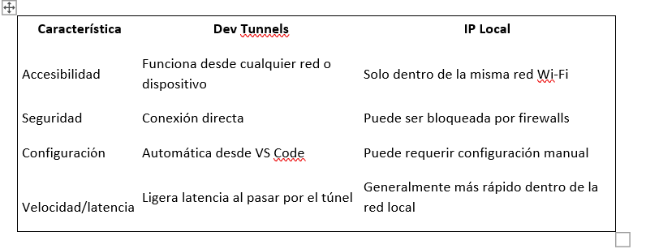

ACTIVIDAD 2:
## ¿Por qué es necesario Dev Tunnels en este escenario y cómo funciona conceptualmente?
Dev Tunnels es necesario porque permite que un servidor local (en localhost:3000) pueda ser accedido desde otro dispositivo, como un celular, sin importar la red en la que esté.
Conceptualmente, Dev Tunnels crea una URL pública que actúa como puente entre Internet y nuestro servidor local. Cuando un dispositivo externo entra a esa URL, Dev Tunnels reenvía la conexión directamente al puerto 3000 en nuestra máquina. 
## ¿Por qué usamos JSON.stringify() en el emisor (móvil) y JSON.parse() en el receptor (escritorio)? ¿Qué problema resuelve JSON aquí?
JSON.stringify() se usa para convertir un objeto JavaScript (como las coordenadas de un toque) en una cadena de texto que se puede enviar por red.
Luego, JSON.parse() en el receptor convierte esa cadena de vuelta en un objeto utilizable. 
El uso de JSON hace que los datos sean estructurados, claros y fáciles de interpretar, lo que permite agregar más información en el futuro si se necesita.
## ¿Cuál es la función de touchMoved() y por qué se usa la variable threshold en el cliente móvil?
La función touchMoved() en p5.js se ejecuta cada vez que el usuario mueve el dedo por la pantalla. En este proyecto, sirve para capturar la posición del toque y enviarla al servidor para mover el círculo en el cliente de escritorio.
La variable threshold se usa para reducir la cantidad de mensajes enviados. Si el dedo apenas se mueve (por ejemplo, tiembla un poco), no se envía nada. Solo si la distancia entre el toque actual y el anterior supera cierto valor, se considera un cambio importante y se envían los datos. 

## ¿Qué otros eventos táctiles existen en p5.js y para qué tipo de interacciones podrían ser útiles?
* touchStarted(): se ejecuta cuando el usuario toca la pantalla por primera vez. 
* touchEnded(): se ejecuta cuando el usuario levanta el dedo. 
## Comparación: Dev Tunnels vs IP Local

